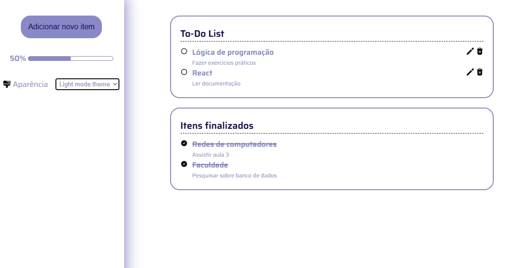

# To-do List

O projeto se trata de uma aplicação de uma to-do list onde é possível adicionar itens e suas descrições. Possui a funcionalidade de editar e excluir o item assim como de selecionar se o item já foi concluído. Além de tais fubncioalidades, a aplicação também calcula o percentual concluído das atividades listadas. São disponibilizados também alguns temas para que o usuário personalize a aparência do seu ambiente. O projeto foi desenvolvido utilizando HTML, CSS e JavaScript. 

## Conteúdos:

- [Apresentação](#apresentação)
  - [Preview do projeto](#preview-do-projeto)
  - [Links do projeto](#links-do-projeto)
  - [Instruções para o uso da aplicação](#instruções-para-o-uso-da-aplicação)
- [Meu processo de desenvolvimento](#meu-processo-de-desenvolvimento)
  - [Projeto construído com](#projeto-construído-com)
- [Autora](#autora)

## Apresentação

### Preview do projeto

### Links do projeto

- URL do repositório no Github: [https://github.com/marinasp13/to-do-list](https://github.com/marinasp13/to-do-list)
- URL Github Pages: 

### Instruções para o uso da aplicação

-
-

## Meu processo de desenvolvimento

### Projeto construído com

- HTML semântico
- HTML seo
- CSS responsivo para dispositivos móveis, tables e desktop
- Javascript: manipulação do DOM
- Javascript: módulos, importar e exportar funcionalidades
- Javascript: eventos

## Autora

- Nome: Marina Pereira
- Email: marinasp.dev@gmail.com
- Github: marinasp13
